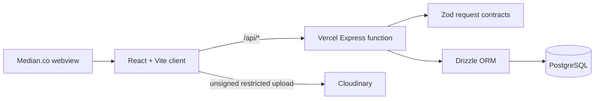

<div align="center">
  
  <h1>BloomBook</h1>
  <p><strong>Where little moments bloom forever.</strong></p>
  <p>A private, mobile-first memory journal for photographs, films, places, stories, recipes, wishes, and the tiny details worth keeping.</p>

  <p>
    <a href="https://bloom-book-api-server.vercel.app"><strong>Open BloomBook</strong></a>
    ·
    <a href="https://bloom-book-api-server.vercel.app/api/healthz">API health</a>
    ·
    <a href="docs/PRODUCTION_REPORT.md">Production report</a>
  </p>

  <p>
    
    
    
    
    
  </p>
</div>

---

## The journal

BloomBook wraps a production web application and API in a warm, tactile scrapbook experience designed primarily for phones and Median.co webviews.

| Space | What it preserves |
| --- | --- |
| Memory Wall | Photographs, videos, dates, captions, and favorites |
| Café Passport | Places, dishes, ratings, and return-worthy discoveries |
| Bookshelf | Books, quotes, reflections, ratings, and lasting reads |
| Movie Corner | Films, genres, ratings, and associations |
| Someday List | Wishes, notes, and completed dreams |
| Memory Capsules | Messages protected until their unlock date |
| Kitchen Diaries | Recipes, photographs, moods, notes, and ratings |
| Random Reviews | Reviews of anything worth having an opinion about |

## Engineering highlights

- React 19, strict TypeScript, Vite 7, Tailwind CSS 4, and route-level code splitting.
- TanStack Query with bounded retries, abort propagation, foreground refresh, and reconnect recovery.
- Express 5 serverless API with Zod validation, defensive headers, JSON limits, and consistent failure responses.
- PostgreSQL through Drizzle ORM and a serverless-conscious connection pool.
- Cloudinary image/video uploads with validation, progress, timeout, cancellation, retry, and previews.
- Global and route-level error boundaries, Suspense fallbacks, offline shell, and service-worker recovery.
- Median-ready safe areas, dynamic viewport units, 44 px touch targets, reduced-motion support, and deep links.

## Architecture



The deployable client and serverless API live in `vercel-deploy/`. Shared source artifacts and the OpenAPI contract live in `artifacts/` and `lib/`. Read the complete [architecture audit](docs/ARCHITECTURE_AUDIT.md) for dependency, database, API, and user-flow details.

## Quick start

### Requirements

- Node.js 22
- npm 10+
- PostgreSQL database
- Cloudinary unsigned upload preset for persistent media

### Install and run

```bash
git clone https://github.com/Tanmay2006-Tech/Bloom-Book.git
cd Bloom-Book
npm install
copy .env.production.example .env.local
npm run dev
```

Open `http://localhost:5173`. The local API listens on `http://localhost:3001`.

On macOS or Linux, replace the `copy` command with:

```bash
cp .env.production.example .env.local
```

## Environment

| Variable | Required | Exposure | Purpose |
| --- | :---: | --- | --- |
| `DATABASE_URL` | Yes | Server only | PostgreSQL connection string |
| `SESSION_SECRET` | Reserved | Server only | Future authentication/session signing; use 32+ random bytes |
| `VITE_CLOUDINARY_CLOUD_NAME` | For media | Public | Cloudinary cloud identifier |
| `VITE_CLOUDINARY_UPLOAD_PRESET` | For media | Public | Restricted unsigned upload preset |
| `CORS_ORIGIN` | Recommended | Server only | Comma-separated trusted origins |
| `NODE_ENV` | Production | Server | Runtime mode |

Never put passwords or private API keys in a `VITE_` variable—Vite intentionally exposes those values to the browser.

## Quality commands

```bash
npm run typecheck       # strict TypeScript validation
npm run build           # typecheck + production Vite build
npm run smoke:api       # local health and missing-database behavior
npm run smoke:live-api  # full deployed CRUD suite with automatic cleanup
```

The live suite defaults to BloomBook’s deployed API. Override it when testing Preview deployments:

```bash
API_BASE_URL=https://your-preview.vercel.app npm run smoke:live-api
```

PowerShell:

```powershell
$env:API_BASE_URL="https://your-preview.vercel.app"; npm run smoke:live-api
```

The live suite creates disposable records with a `Codex API check` prefix and removes every created record in a `finally` cleanup—even if a later assertion fails.

## API

Production base: [`https://bloom-book-api-server.vercel.app/api`](https://bloom-book-api-server.vercel.app/api/healthz)

| Resource | Operations |
| --- | --- |
| `/healthz`, `/stats`, `/timeline` | Health, dashboard totals, recent activity |
| `/memories` | List, create, read, update, delete, favorite |
| `/cafes` | List, create, read, update, delete |
| `/books` | List/filter, create, read, update, delete |
| `/movies` | List, create, read, update, delete |
| `/wishlist` | List, create, update, delete, complete |
| `/capsules` | List, create, read, delete, unlock |
| `/kitchen` | List/filter, create, read, update, delete |
| `/reviews` | List, create, read, update, delete |

The source of truth is [OpenAPI](lib/api-spec/openapi.yaml). Generated query clients and schemas keep the browser and API contract aligned.

## Deploy to Vercel

1. Import the GitHub repository into Vercel.
2. Keep **Root Directory** at the repository root.
3. Select **Node.js 22**.
4. Add the production environment variables above.
5. Deploy. Root `vercel.json` runs `npm run build`, serves `vercel-deploy/dist`, routes `/api/*` to the serverless function, and rewrites all remaining paths to the SPA.
6. Run `npm run smoke:live-api` against the deployment before promoting it.

If an existing Vercel project uses `vercel-deploy` as its Root Directory, that directory also has an independent npm lockfile and deployment configuration.

## Deploy the Neon database

Set the Neon pooled connection string as `DATABASE_URL` in `.env.local`, then run:

```bash
npm run db:migrate
```

This applies the checked-in eight-table migration and records it in `__drizzle_migrations`. Use `npm run db:push` only for development or a deliberate empty-database bootstrap. See the [Database Deployment Report](docs/DATABASE_DEPLOYMENT_REPORT.md) for the full table map, indexes, environment behavior, and release workflow.

## Package with Median.co

1. Deploy a canonical HTTPS Vercel URL.
2. Use that URL as the Median app URL.
3. Enable iOS camera/photo-library and Android camera/media permissions.
4. Allowlist the Vercel origin and `api.cloudinary.com`.
5. Preserve DOM storage and navigation history; test Android system back gestures.
6. Use `#FFF8F0` for the status/navigation bar theme.
7. Certify uploads, cancellation, offline recovery, keyboard drawers, notches, Dynamic Island, and gesture navigation on physical Samsung, Pixel, and iPhone devices.

See the [Median.co Mobile Readiness Report](docs/PRODUCTION_REPORT.md#medianco-mobile-readiness-report) for scores, risks, and required device checks.

## Security boundary

BloomBook currently models one private shared journal. API inputs are validated, SQL is parameterized, request sizes and database waits are bounded, internal failures are concealed, and browser output is escaped—but there is no authentication or per-user ownership yet.

Keep the deployment private or behind Vercel protection. Before public or multi-user distribution, add authentication, authorization, ownership columns, rate limiting, CSRF controls, data export/deletion, monitoring, and a privacy policy.

## Documentation

- [Architecture audit](docs/ARCHITECTURE_AUDIT.md)
- [Production and Median readiness report](docs/PRODUCTION_REPORT.md)
- [Database deployment report](docs/DATABASE_DEPLOYMENT_REPORT.md)
- [OpenAPI contract](lib/api-spec/openapi.yaml)

---

<div align="center">
  <sub>Built as a gift. Engineered to keep the meaningful things close.</sub>
</div>
