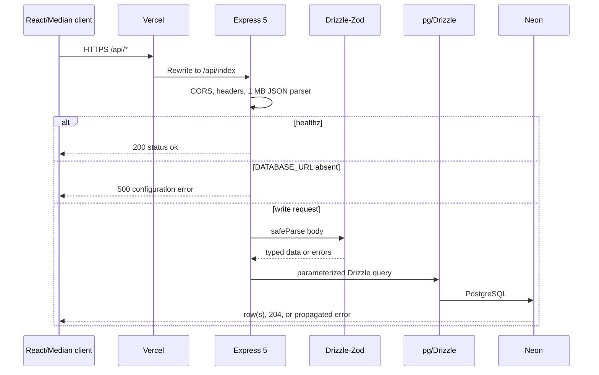

# BloomBook API Report

Audit date: 2026-07-02  
Production base path: `/api`  
Production implementation: `vercel-deploy/api/index.ts`  
Root Vercel bridge: `api/index.ts`

## Architecture

BloomBook exposes one Express 5 application as a Vercel serverless function. The root Vercel function re-exports the app implemented under `vercel-deploy`. A separate modular API under `artifacts/api-server` is legacy/reference code and is not reached by the recommended deployment.

The intended contract is `lib/api-spec/openapi.yaml`. Orval generated three representations from it:

- `lib/api-client-react`: legacy React Query client;
- `lib/api-zod`: legacy server validators and response schemas;
- `vercel-deploy/src/lib/api.ts` and `api.schemas.ts`: copied production client/types.

The production server does **not** import those generated server schemas. It declares equivalent Drizzle tables inline and derives most body schemas with Drizzle Zod. This duplication is the main contract-drift risk.

## Request lifecycle



## Middleware

| Order | Middleware | Behavior |
| ---: | --- | --- |
| 1 | `app.disable("x-powered-by")` | Suppresses Express disclosure |
| 2 | CORS | Uses comma-separated `CORS_ORIGIN`; reflects request origins if absent |
| 3 | Security/cache headers | nosniff, same-origin framing, referrer/permissions policy, no-store |
| 4 | `express.json({limit:"1mb"})` | Parses and bounds JSON requests |
| 5 | Database configuration guard | Exempts `/healthz`; rejects data routes when URL missing |
| 6 | Route handlers | Validation, Drizzle query, serialization |
| 7 | `/api` 404 | JSON `{error:"API route not found"}` |
| 8 | Error middleware | Logs server-side and returns generic 500 JSON |

The server has no authentication, authorization, rate limiter, CSRF middleware, request correlation ID, structured logger, transaction middleware, or metrics instrumentation.

## Endpoint inventory

There are **44 production endpoints**.

### System and aggregate endpoints

| Method | Path | Input | Success | Notes |
| --- | --- | --- | --- | --- |
| GET | `/api/healthz` | None | 200 health JSON | Liveness only; does not query Neon |
| GET | `/api/stats` | None | 200 counts object | Selects seven complete tables and counts rows in memory; capsules omitted |
| GET | `/api/timeline` | None | 200 recent item array | Derived from memories, cafes, books, movies, kitchen, reviews; no timeline table |

### Memories

| Method | Path | Input | Success | Failure behavior |
| --- | --- | --- | --- | --- |
| GET | `/api/memories` | Query: `favorite`, `search` | 200 array | Query params unvalidated; filtering occurs in JS |
| POST | `/api/memories` | Memory insert body | 201 row | 400 invalid body |
| GET | `/api/memories/:id` | ID | 200 row | 404 missing; ID unvalidated |
| PATCH | `/api/memories/:id` | Partial memory body | 200 row | 400 invalid; 404 missing |
| DELETE | `/api/memories/:id` | ID | 204 | Returns 204 even when absent |
| PATCH | `/api/memories/:id/favorite` | ID | 200 toggled row | 404 missing; read-then-write race possible |

### Cafés

| Method | Path | Input | Success | Failure behavior |
| --- | --- | --- | --- | --- |
| GET | `/api/cafes` | None | 200 array | Ordered by creation time |
| POST | `/api/cafes` | Café insert body | 201 row | 400 invalid body |
| GET | `/api/cafes/:id` | ID | 200 row | 404 missing |
| PATCH | `/api/cafes/:id` | Partial café body | 200 row | 400 invalid; 404 missing |
| DELETE | `/api/cafes/:id` | ID | 204 | Returns 204 even when absent |

### Books

| Method | Path | Input | Success | Failure behavior |
| --- | --- | --- | --- | --- |
| GET | `/api/books` | Query: `status` | 200 array | Filter is performed in JS |
| POST | `/api/books` | Book insert body | 201 row | 400 invalid body |
| GET | `/api/books/:id` | ID | 200 row | 404 missing |
| PATCH | `/api/books/:id` | Partial book body | 200 row | 400 invalid; 404 missing |
| DELETE | `/api/books/:id` | ID | 204 | Returns 204 even when absent |

### Movies

| Method | Path | Input | Success | Failure behavior |
| --- | --- | --- | --- | --- |
| GET | `/api/movies` | None | 200 array | Ordered by creation time |
| POST | `/api/movies` | Movie insert body | 201 row | 400 invalid body |
| GET | `/api/movies/:id` | ID | 200 row | 404 missing |
| PATCH | `/api/movies/:id` | Partial movie body | 200 row | 400 invalid; 404 missing |
| DELETE | `/api/movies/:id` | ID | 204 | Returns 204 even when absent |

### Wishlist

| Method | Path | Input | Success | Failure behavior |
| --- | --- | --- | --- | --- |
| GET | `/api/wishlist` | None | 200 array | No item GET endpoint |
| POST | `/api/wishlist` | Wish insert body | 201 row | 400 invalid body |
| PATCH | `/api/wishlist/:id` | Partial wish body | 200 row | 400 invalid; 404 missing |
| DELETE | `/api/wishlist/:id` | ID | 204 | Returns 204 even when absent |
| PATCH | `/api/wishlist/:id/toggle` | ID | 200 toggled row | 404 missing; read-then-write race possible |

### Capsules

| Method | Path | Input | Success | Failure behavior |
| --- | --- | --- | --- | --- |
| GET | `/api/capsules` | None | 200 array | Dates explicitly serialized to ISO strings |
| POST | `/api/capsules` | `title`, `message`, `unlockAt` strings | 201 row | 400 shape error; date string is not validated before `new Date` |
| GET | `/api/capsules/:id` | ID | 200 row | 404 missing |
| DELETE | `/api/capsules/:id` | ID | 204 | Returns 204 even when absent |
| PATCH | `/api/capsules/:id/unlock` | ID | 200 unlocked row | 404 missing; API does not enforce unlock time |

### Kitchen

| Method | Path | Input | Success | Failure behavior |
| --- | --- | --- | --- | --- |
| GET | `/api/kitchen` | Query: `type` | 200 array | Filter is performed in JS |
| POST | `/api/kitchen` | Kitchen entry body | 201 row | 400 invalid body |
| GET | `/api/kitchen/:id` | ID | 200 row | 404 missing |
| PATCH | `/api/kitchen/:id` | Partial entry body | 200 row | 400 invalid; 404 missing |
| DELETE | `/api/kitchen/:id` | ID | 204 | Returns 204 even when absent |

### Reviews

| Method | Path | Input | Success | Failure behavior |
| --- | --- | --- | --- | --- |
| GET | `/api/reviews` | None | 200 array | Physical table is `random_reviews` |
| POST | `/api/reviews` | Review insert body | 201 row | 400 invalid body |
| GET | `/api/reviews/:id` | ID | 200 row | 404 missing |
| PATCH | `/api/reviews/:id` | Partial review body | 200 row | 400 invalid; 404 missing |
| DELETE | `/api/reviews/:id` | ID | 204 | Returns 204 even when absent |

## Client behavior

The generated client maps every endpoint to a typed function, query key factory, TanStack query option factory, and hook. `customFetch` adds a 12-second timeout and retries GET requests after network/5xx failures with 350 ms and 900 ms backoff. Mutations are not retried globally to avoid duplicate writes.

Page-level mutations invalidate their collection query and usually dashboard stats/timeline. Only the memory page exposes deletion. Update/delete endpoints for other resources exist but are not exposed in most page UIs.

## Validation gaps

- IDs are arbitrary strings in production; generated parameter validators are unused.
- Query parameters are cast from Express values without Zod validation.
- Response objects are not checked against OpenAPI response schemas.
- Rating ranges, enum-like text fields, URL formats, and maximum string lengths are not constrained at the database level.
- Capsule `unlockAt` accepts any string shape and unlock authorization is UI-only.
- `stripNulls` prevents explicitly clearing nullable fields to SQL NULL.
- Production uses `any` casts around Drizzle writes, weakening compile-time guarantees.

## API implementation drift

| Concern | Production API | Legacy artifact API |
| --- | --- | --- |
| File structure | One 446-line file | Modular route files |
| Table schema | Inline duplicate | Imports `@workspace/db` |
| Validators | Drizzle-Zod body schemas | Generated `@workspace/api-zod` schemas |
| Response validation | None | Generated response `.parse` |
| Logging | `console.error` only | Pino/Pino HTTP |
| Delete missing record | 204 | 404 |
| Deployability | Active npm/Vercel | Legacy pnpm workspace |

## Verification commands

```bash
npm run smoke:api
npm run smoke:live-api
```

The local smoke test validates liveness and graceful missing-database behavior. The live suite exercises all endpoint families using uniquely named disposable records and cleans them up in `finally`.

## API risks

1. Unauthenticated public read/write access.
2. Production/OpenAPI/database schema duplication.
3. No rate limiting or audit logging.
4. Race-prone toggles.
5. Early capsule unlock possible through direct calls.
6. Full-table stats and in-memory filtering.
7. Inconsistent missing-delete semantics.
8. No idempotency keys for creates.
9. No transactions around multi-query operations.
10. No versioning strategy beyond the fixed `/api` prefix.

