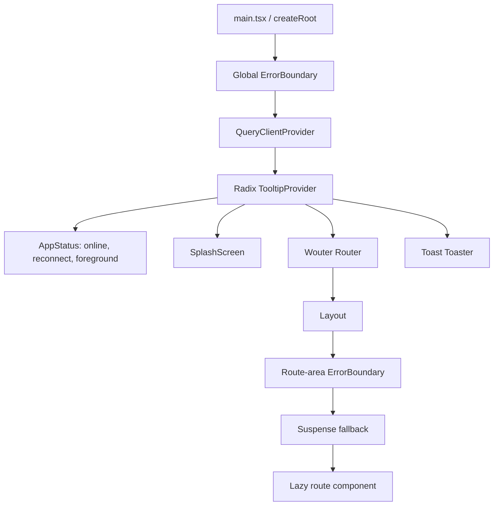
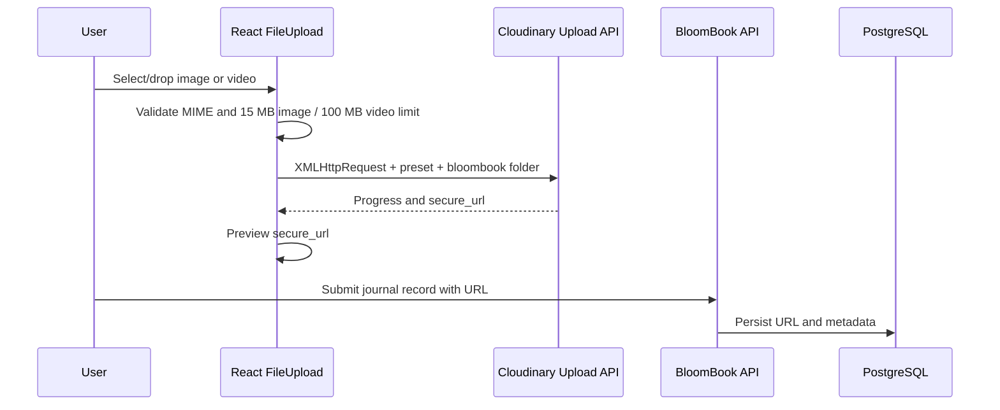
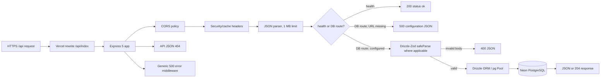
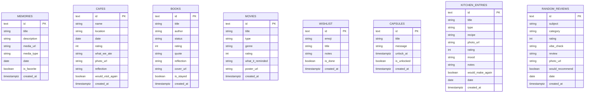
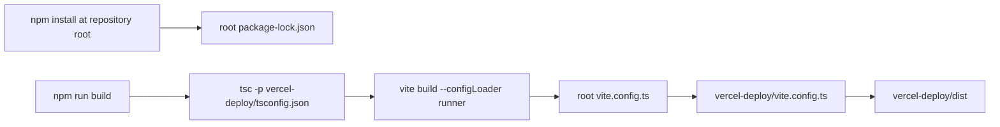
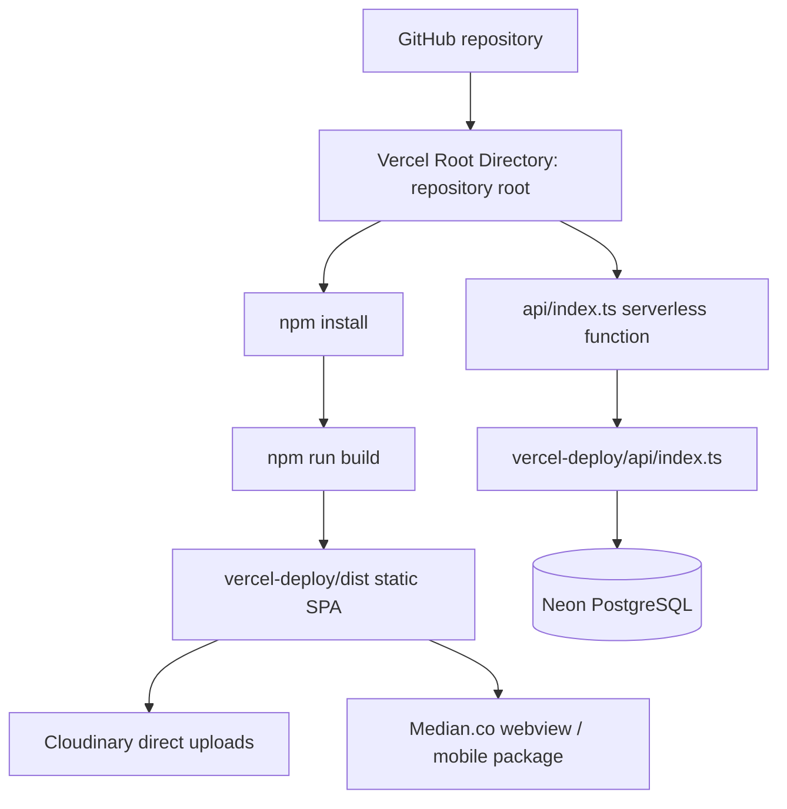

# BloomBook Architecture Audit

Audit date: 2026-07-02  
Scope: complete repository worktree, including production code, generated code, legacy artifacts, configuration, migrations, scripts, and deployment manifests.

## Executive conclusion

BloomBook is a mobile-first React single-page application backed by an Express serverless API and PostgreSQL. The repository began as a pnpm/Replit-style monorepo and has been partially flattened into a standard npm/Vercel deployment.

The **actual production source is `vercel-deploy/`**, but the **correct Vercel Root Directory is the repository root**. Root configuration delegates Vite to `vercel-deploy/vite.config.ts`, builds into `vercel-deploy/dist`, and exposes the root `api/index.ts` bridge to Vercel. `vercel-deploy/` can also deploy independently because it has its own package and Vercel configuration, but maintaining two supported deployment roots increases drift risk.

The repository contains three parallel architectural layers:

1. **Production runtime:** `vercel-deploy/` plus root `api/`, `package.json`, `vite.config.ts`, and `vercel.json`.
2. **Legacy/reference monorepo:** `artifacts/`, `lib/`, `scripts/package.json`, root TypeScript project references, and `@workspace/*`/`catalog:` manifests.
3. **Canonical contracts and persistence definitions:** `lib/api-spec`, generated clients/Zod schemas, `lib/db/src/schema`, root `drizzle.config.ts`, and `drizzle/` migrations.

The largest architectural risk is duplication: production frontend files differ from `artifacts/bloombook`; the production API duplicates the canonical artifact router and Drizzle table definitions; and the production client contains a copied generated API client. Changes can therefore compile in one layer while silently drifting in another.

## Repository tree

Generated dependencies and build output are omitted.

```text
Bloom-Book/
├── api/
│   └── index.ts                         # Root Vercel API bridge
├── artifacts/                           # Legacy Replit/pnpm artifact packages
│   ├── api-server/
│   │   ├── src/
│   │   │   ├── app.ts                   # Canonical modular Express artifact
│   │   │   ├── index.ts                 # Standalone Node listener
│   │   │   ├── lib/logger.ts
│   │   │   └── routes/*.ts              # Modular API routes
│   │   ├── build.mjs
│   │   └── package.json                 # Uses workspace:/catalog: remnants
│   ├── bloombook/
│   │   ├── src/                          # Older copy of frontend
│   │   ├── public/
│   │   ├── vite.config.ts
│   │   └── package.json                 # Uses workspace:/catalog: remnants
│   └── mockup-sandbox/                   # Design/mockup tooling, not production
├── docs/
│   ├── ARCHITECTURE_AUDIT.md
│   ├── DATABASE_DEPLOYMENT_REPORT.md
│   └── PRODUCTION_REPORT.md
├── drizzle/
│   ├── 0000_mute_karen_page.sql         # Initial eight-table migration
│   └── meta/                             # Drizzle migration journal/snapshot
├── lib/
│   ├── api-client-react/                 # Legacy generated React Query client
│   ├── api-spec/
│   │   ├── openapi.yaml                  # API contract source
│   │   └── orval.config.ts               # Client/Zod code generation
│   ├── api-zod/                          # Generated server Zod schemas
│   └── db/
│       └── src/
│           ├── index.ts                  # Legacy shared pool/Drizzle client
│           └── schema/*.ts               # Canonical database schema
├── scripts/
│   ├── smoke-live-api.ts                 # Live CRUD smoke test with cleanup
│   ├── verify-database-migration.ts       # Embedded PostgreSQL migration test
│   ├── package.json                      # Legacy workspace package
│   └── src/hello.ts                      # Placeholder legacy script
├── vercel-deploy/                        # ACTUAL PRODUCTION APPLICATION
│   ├── api/
│   │   ├── index.ts                      # Production Express API/function
│   │   └── _server.ts                    # Local API listener
│   ├── public/
│   │   ├── manifest.webmanifest
│   │   ├── offline.html
│   │   └── sw.js                         # Offline shell service worker
│   ├── scripts/smoke-api.ts
│   ├── src/
│   │   ├── main.tsx                      # React entrypoint
│   │   ├── App.tsx                       # Providers, router, lazy routes
│   │   ├── index.css                     # Tailwind theme/mobile shell
│   │   ├── components/
│   │   │   ├── layout.tsx
│   │   │   ├── error-boundary.tsx
│   │   │   ├── app-status.tsx
│   │   │   ├── file-upload.tsx
│   │   │   └── ui/*                      # Large shadcn/Radix component inventory
│   │   ├── hooks/*
│   │   ├── lib/
│   │   │   ├── api.ts                    # Copied generated React Query client
│   │   │   ├── api.schemas.ts
│   │   │   ├── custom-fetch.ts
│   │   │   └── utils.ts
│   │   └── pages/*.tsx                   # Nine pages plus not-found
│   ├── index.html
│   ├── package.json                      # Independent nested npm deployment
│   ├── package-lock.json
│   ├── postcss.config.mjs
│   ├── tsconfig.json
│   ├── vercel.json
│   └── vite.config.ts
├── .env.production.example
├── drizzle.config.ts                     # Canonical root Drizzle Kit config
├── package.json                          # Canonical npm command surface
├── package-lock.json
├── tsconfig.base.json                    # Legacy project-reference base
├── tsconfig.json                         # Legacy lib references
├── vercel.json                           # Canonical Vercel deployment config
└── vite.config.ts                        # Re-exports production Vite config
```

## Folder classification

| Path | Classification | Deployable? | Notes |
| --- | --- | :---: | --- |
| `/` | Canonical command/deployment root | Yes | Recommended Vercel Root Directory |
| `vercel-deploy/` | Production source and optional standalone root | Yes | Contains client, API, lockfile, and nested Vercel config |
| `api/` | Root serverless bridge | With root | Imports `vercel-deploy/api/index.ts` |
| `drizzle/` | Production migration history | Via CLI | Must be committed and applied separately |
| `lib/db/src/schema/` | Canonical database model | No | Drizzle Kit schema source |
| `lib/api-spec/` | Canonical intended HTTP contract | No | OpenAPI/Orval source; not imported at production runtime |
| `lib/api-client-react/` | Legacy generated client | No | Production uses its copied equivalent under `vercel-deploy/src/lib` |
| `lib/api-zod/` | Legacy generated server validation | No | Artifact API uses it; production API does not |
| `artifacts/bloombook/` | Legacy frontend copy | Technically, but should not | Hashes differ from production files |
| `artifacts/api-server/` | Legacy modular backend | Technically, but should not | Uses workspace/catalog protocols and shared libs |
| `artifacts/mockup-sandbox/` | Design/prototyping sandbox | No | Not part of product runtime |
| `scripts/` package scaffolding | Legacy workspace remnant | No | Root-level QA scripts are useful; `hello.ts` is placeholder |
| `.agents/` | Tool memory | No | Not product code |

## Frontend architecture

### Entrypoint and provider graph

`vercel-deploy/src/main.tsx`:

1. Sets the generated HTTP client base URL to same-origin.
2. Requires `#root` and mounts React 19 with `createRoot`.
3. Imports the global Tailwind/theme stylesheet.
4. Registers `/sw.js` only in production.

`vercel-deploy/src/App.tsx` composes:



### Routing

Wouter supplies client-side routing. All page modules are loaded with `React.lazy`, and the route switch is wrapped in `Suspense` and a resettable error boundary.

| URL | Component | Primary data |
| --- | --- | --- |
| `/` | `Dashboard` | `/stats`, `/timeline` |
| `/wall` | `MemoryWall` | `/memories`; create, favorite, delete |
| `/cafes` | `CafePassport` | `/cafes`; create; upload image |
| `/books` | `Bookshelf` | `/books`; create/filter fields |
| `/movies` | `NetflixCorner` | `/movies`; create |
| `/someday` | `SomedayList` | `/wishlist`; create/toggle |
| `/capsules` | `MemoryCapsules` | `/capsules`; create/unlock |
| `/kitchen` | `KitchenDiaries` | `/kitchen`; filter/create/upload image |
| `/reviews` | `RandomReviews` | `/reviews`; create |
| unmatched | `NotFound` | No remote data |

Vercel rewrites every non-API path to `/`, so direct navigation and refresh return the SPA shell. The service worker also treats navigation as network-first with cached-shell fallback.

### Layout system

`Layout` constrains the application to a 480 px mobile canvas, renders a fixed safe-area-aware bottom navigation, exposes four primary routes directly, and places five secondary routes in a Vaul bottom drawer. Individual pages own their floating add buttons and form drawers.

The CSS is mobile-first: `100dvh`, four safe-area insets, coarse-pointer 44 px targets, horizontal overflow protection, reduced-motion overrides, and a 360–430 px-friendly single-column layout. Desktop presentation remains a centered phone-like canvas.

### Components and UI libraries

- **Radix UI:** accessible low-level primitives; Tooltip and Toast are active globally.
- **Vaul:** bottom drawers used for forms and secondary navigation.
- **Framer Motion:** page/card transitions, drawer content effects, and micro-interactions.
- **Lucide React / React Icons:** icons.
- **Tailwind CSS 4:** utility styling and custom BloomBook theme.
- **shadcn-style inventory:** approximately 50 UI primitive files exist, but production pages directly use very few (`card`, `toast/toaster`, `tooltip`). Much of this directory is unused generated inventory.

Shared product components include `Layout`, `FileUpload`, `EmptyState`, `FloralDeco`, `SplashScreen`, `AppStatus`, and `ErrorBoundary`.

### State management

There is no Redux, Zustand, or global domain store.

- **Server state:** TanStack Query.
- **Local UI/form state:** React `useState` in each page.
- **Navigation state:** Wouter URL/location.
- **Toast state:** custom reducer/subscriber hook.
- **Connectivity/lifecycle state:** `AppStatus` plus TanStack `onlineManager`.

Queries use a 30-second stale time, do not refetch merely on window focus, and retry GET failures up to two times except non-5xx API errors. Foreground, pageshow, and reconnect events explicitly invalidate active queries. Mutations do not automatically retry; successful mutations invalidate collection/dashboard/timeline query keys. Optimistic updates are not used.

### Data fetching

`vercel-deploy/src/lib/api.ts` and `api.schemas.ts` are copied Orval-generated clients/types. Page hooks call a common `customFetch` adapter, which provides:

- same-origin or configurable base URL;
- optional bearer-token getter (unused in the web app);
- response content-type handling;
- typed HTTP and parse errors;
- 12-second timeout;
- abort propagation;
- retries for GET requests after network or 5xx failures;
- JSON/text/blob response parsing.

The generated client is based on `lib/api-spec/openapi.yaml`, but code generation is not part of the root build. Contract regeneration remains a legacy pnpm command, so generated production files can drift.

### Error and offline behavior

- A global error boundary protects the provider tree.
- A route-area error boundary resets when the pathname changes.
- Lazy pages have a Suspense fallback.
- Query/mutation failures dispatch a global event consumed by `AppStatus`.
- `AppStatus` presents offline/service failure UI and a retry action.
- A production service worker caches the application shell and same-origin GET assets.
- Page components generally implement loading and empty states, but most do **not** render page-specific query error states; global status UI carries that responsibility.

### Upload architecture

`FileUpload` uploads directly from the browser/webview to Cloudinary using an unsigned preset:



The component supports progress, cancellation, 120-second timeout, retry after failure, preview, replacement, and removal. If Cloudinary variables are missing, it blocks media upload with a recoverable message while allowing text-only records. Multi-file upload, server-signed uploads, deduplication, and orphan cleanup are not implemented.

### Authentication architecture

There is **no authentication architecture in active production code**:

- no login/logout UI;
- no users, sessions, accounts, roles, or ownership tables;
- no authorization middleware;
- no cookie/session parser in the production function;
- no CSRF mechanism;
- `SESSION_SECRET` is documented/reserved but unused;
- `customFetch` supports bearer tokens generically, but no token getter is registered.

Every API route is publicly callable by anyone who can reach the deployment. BloomBook is therefore a single shared journal and must remain private or protected externally.

## Backend architecture

### Entrypoints

- Root Vercel function: `api/index.ts` → imports default app from `vercel-deploy/api/index.ts`.
- Optional nested Vercel function: `vercel-deploy/api/index.ts` directly.
- Local listener: `vercel-deploy/api/_server.ts`, default port 3001.
- Legacy standalone backend: `artifacts/api-server/src/index.ts` and modular `app.ts`; not used by the recommended deployment.

### Production request lifecycle



### Middleware and operational behavior

- Express disclosure disabled.
- CORS origins come from comma-separated `CORS_ORIGIN`; if omitted, `origin: true` reflects request origins.
- Headers: `X-Content-Type-Options`, `X-Frame-Options`, `Referrer-Policy`, `Permissions-Policy`, and `Cache-Control: no-store`.
- JSON request bodies limited to 1 MB.
- Database pool: maximum five connections, 5-second connection timeout, 10-second query/statement timeout, 30-second idle timeout, and `allowExitOnIdle` for serverless behavior.
- Missing `DATABASE_URL` leaves `/api/healthz` alive and returns a clear 500 on database routes.
- Express 5 propagates rejected async handlers to the generic error middleware.
- There is no rate limiting, authentication, request ID, structured logging, metrics, tracing, or transaction layer.

### Validation and serialization

The production API declares Drizzle tables inline and builds insert/update validators using `createInsertSchema`. Capsule creation uses a handwritten Zod object. IDs and query parameters are not validated through the generated Zod parameter schemas in production. Responses are returned directly rather than parsed against OpenAPI response schemas.

The legacy artifact API is more modular and uses `@workspace/api-zod` for request parameters, bodies, and response serialization, plus Pino logging. It is not the deployed app.

## API architecture summary

There are 44 production endpoints: 3 system/aggregate endpoints and 41 collection/item/action endpoints. All use the `/api` prefix. Full details are in `API_REPORT.md`.

Notable behavior:

- `stats` selects whole tables and counts rows in memory instead of SQL `count(*)`.
- `timeline` is derived from six collection tables; **there is no timeline table**.
- memories/books/kitchen filters load rows and filter in JavaScript rather than SQL.
- favorite/done toggles are read-then-write operations and can race.
- production delete handlers return 204 even if no row existed; the legacy artifact returns 404.
- capsule unlock is enforced by the UI, not by the production API; the endpoint can unlock early.

## Database architecture

### Canonical files

- Schema barrel: `lib/db/src/schema/index.ts`.
- Eight schema modules: memories, cafes, books, movies, wishlist, capsules, kitchen, reviews.
- Legacy runtime connection: `lib/db/src/index.ts`.
- Root Drizzle Kit config: `drizzle.config.ts`.
- Migration: `drizzle/0000_mute_karen_page.sql` and `drizzle/meta/*`.
- Local migration verifier: `scripts/verify-database-migration.ts` using PGlite.

### Entity relationship model

The domain is eight independent aggregates with no foreign keys:



All IDs are text UUIDs generated in application code with `$defaultFn`; the SQL schema has no database-side UUID default. All tables have primary keys and `created_at` indexes; filter indexes exist for memory favorites, book status, capsule unlock time, and kitchen type. There are no ownership columns, foreign keys, unique business constraints, check constraints, soft deletes, or audit/version columns.

### Migration strategy

Production should use versioned migrations:

```bash
npm run db:migrate
```

For a deliberate empty development/Neon bootstrap, direct schema synchronization is available:

```bash
npm run db:push
```

The root config reads `DATABASE_URL` from the process, `.env.local`, then `.env`. It targets PostgreSQL, includes the schema barrel, writes migrations to `drizzle/`, and records applied migrations in `public.__drizzle_migrations`.

## Environment configuration

| Variable | Active use | Required | Surface |
| --- | --- | :---: | --- |
| `DATABASE_URL` | Production API pool; Drizzle push/migrate/studio; smoke test | Yes for data | Server/CLI secret |
| `VITE_CLOUDINARY_CLOUD_NAME` | Browser upload endpoint construction | Yes for media | Public client build value |
| `VITE_CLOUDINARY_UPLOAD_PRESET` | Browser unsigned upload form | Yes for media | Public client build value |
| `CORS_ORIGIN` | Production Express CORS allowlist | Recommended | Server |
| `PORT` | Local API listener; legacy Vite/server configs | Optional | Local server |
| `NODE_ENV` | Vercel/runtime convention; legacy logger | Production convention | Server |
| `LOG_LEVEL` | Legacy artifact Pino logger only | No in production | Legacy server |
| `BASE_PATH` | Legacy artifact/mockup Vite configs only | No in production | Legacy build |
| `API_BASE_URL` | Live API smoke test override | Optional | QA CLI |
| `SESSION_SECRET` | Example/documentation only; no runtime reader | Not currently functional | Reserved server secret |
| `BASE_URL` | Vite-provided router base | Automatic | Client build |
| `PROD` | Vite-provided service-worker gate | Automatic | Client build |

Local root placement: use `/.env.local` for developer secrets or export variables in the shell. Drizzle explicitly loads `/.env.local` and `/.env`. Vite also reads root-mode environment files; only `VITE_` values enter the browser bundle. Vercel values must be configured in Project Settings for Production/Preview. Do not commit real secrets.

## Build and dependency architecture

### Command flow



Node requirement is `>=22 <25`; Vercel should use Node 22. The build checks only production `src` and `api`, not legacy artifact/shared projects. Root `tsconfig.json` still references shared libs, but the root `typecheck` script deliberately targets the production config instead.

### Dependency layers

- **Runtime UI:** React, React DOM, Wouter, TanStack Query, Framer Motion, Vaul, Radix packages, Lucide, date-fns, Tailwind utilities.
- **Forms:** pages primarily use controlled React state; `react-hook-form` and resolvers are installed for generated UI infrastructure but not central to product pages.
- **Backend:** Express, CORS, pg, Drizzle ORM, Drizzle Zod, Zod.
- **Build:** Vite, React plugin, Tailwind Vite plugin, TypeScript, tsx, concurrently.
- **Database tooling:** Drizzle Kit, dotenv, PGlite verifier.
- **Legacy codegen:** OpenAPI + Orval in `lib/api-spec`; not installed/executed by root scripts.

The root manifest includes many Radix/shadcn dependencies needed only by unused generated component files. They do not all enter the bundle, but they increase install surface and maintenance overhead.

### Workspace remnants

No root workspace configuration is active and production manifests contain no `workspace:` dependency. However, legacy package manifests still contain `workspace:*` and `catalog:` protocols and pnpm-specific scripts. Those packages cannot be installed independently with plain npm. Root TypeScript references and `customConditions: ["workspace"]` are also remnants.

## Deployment architecture

Recommended Vercel path:



Root `vercel.json`:

- build command: `npm run build`;
- output: `vercel-deploy/dist`;
- `/api/(.*)` rewrite: `/api/index`;
- all other routes: `/` for SPA deep links.

Database migrations are an explicit release step and should not run inside every Vercel build. Apply `npm run db:migrate` against Neon before or alongside the production release.

## Median.co/mobile assessment

The application is structurally ready for a private Median beta:

- phone-first canvas and bottom navigation;
- safe-area handling for notches/home indicators;
- `viewport-fit=cover` and dynamic viewport units;
- coarse-pointer minimum target sizing;
- image/video input and inline playback;
- app background/foreground and network event handling;
- offline shell and reconnect UI;
- lazy routes and error boundaries;
- SPA deep-link support.

Remaining mobile risks:

- physical Median/Samsung/Pixel/iPhone permission and back-navigation tests remain external;
- camera/gallery behavior depends on Median permission configuration;
- unfinished form drafts do not survive OS process eviction;
- Cloudinary uploads are unsigned and client-direct;
- the service worker cache version is manually maintained;
- external Google Fonts add a network dependency;
- a public package exposes the unauthenticated shared journal API.

## Top architectural risks

1. **No authentication or authorization:** every record is globally readable/writable.
2. **Three drifting source representations:** production, artifact, and generated/shared layers are not automatically synchronized.
3. **Production API duplicates schemas/contracts inline:** database/OpenAPI changes can diverge from deployed behavior.
4. **Public unsigned Cloudinary uploads:** preset restrictions and quotas are the only upload security boundary.
5. **No ownership/relations/multi-tenancy model:** the schema cannot safely support multiple users.
6. **No rate limiting or abuse controls:** public mutations and uploads can be automated.
7. **Weak database invariants:** ratings/enums/media type lack check constraints; no soft delete/audit history.
8. **Race-prone toggle endpoints:** favorite and done use read-then-write without transactions/atomic inversion.
9. **Inefficient aggregate/filter queries:** stats and several filters load complete tables into application memory.
10. **Operational gaps:** no structured production logging, error monitoring, tracing, metrics, backups/restore evidence, or automated deployment migration gate.

Additional risks include unused dependency/component surface, an unused `SESSION_SECRET`, inconsistent 404 semantics between production and artifact APIs, early capsule unlock possible through direct API calls, and no durable offline mutation/draft persistence.

## Final architecture decisions

- **Actual production application:** `vercel-deploy/`.
- **Deployable Vercel root:** repository root (recommended).
- **Root API function:** `api/index.ts`.
- **Production API implementation:** `vercel-deploy/api/index.ts`.
- **Canonical database schema:** `lib/db/src/schema/index.ts`.
- **Canonical migration config:** root `drizzle.config.ts`.
- **Intended API contract:** `lib/api-spec/openapi.yaml`.
- **Production generated client:** `vercel-deploy/src/lib/api.ts`.
- **Authentication model:** none; private shared journal only.
