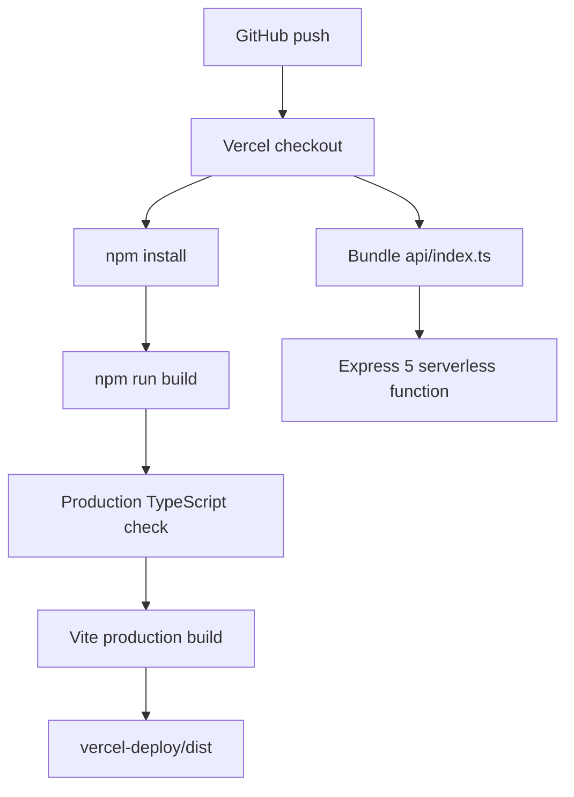

# BloomBook Deployment Report

Audit date: 2026-07-02

## Canonical deployment

| Setting | Value |
| --- | --- |
| Platform | Vercel |
| Recommended Root Directory | Repository root |
| Node.js | 22 (`package.json` permits 22–24) |
| Package manager | npm with root `package-lock.json` |
| Install command | `npm install` or Vercel default |
| Build command | `npm run build` |
| Typecheck | `tsc -p vercel-deploy/tsconfig.json --noEmit` |
| Vite config | Root re-export → `vercel-deploy/vite.config.ts` |
| Static output | `vercel-deploy/dist` |
| API function | `api/index.ts` → `vercel-deploy/api/index.ts` |
| Database | Neon PostgreSQL via `DATABASE_URL` |
| Media | Browser-direct Cloudinary uploads |

## Build flow



The Vite config sets `vercel-deploy` as its root and absolute output directory. `--configLoader runner` avoids ancestor package-config contamination on local machines. Tailwind 4 is integrated through the Vite plugin; `postcss.config.mjs` intentionally stops PostCSS from searching outside the production directory.

## Vercel routing

Root `vercel.json`:

1. `/api/(.*)` rewrites to `/api/index`.
2. Every remaining path rewrites to `/` for SPA routing.

Static files such as the service worker, manifest, icons, and generated assets are served from `vercel-deploy/dist`. Client routes are then resolved by Wouter.

## Exact deployment procedure

1. Create/provision the Neon database.
2. Configure root `.env.local` with Neon for the migration operator.
3. Run `npm run db:migrate`.
4. Import the GitHub repository into Vercel.
5. Leave Root Directory empty/repository root.
6. Select Node.js 22.
7. Add `DATABASE_URL`, Cloudinary values, and recommended `CORS_ORIGIN` in Vercel Project Settings.
8. Deploy with Vercel defaults; `vercel.json` supplies build/output routing.
9. Verify `/api/healthz` and run `npm run smoke:live-api`.
10. Verify every SPA deep link and an image/video upload.

CLI deployment, after authenticating and linking the project:

```bash
npx vercel --prod
```

This command is not a substitute for applying the database migration first.

## Alternative nested deployment

`vercel-deploy/` contains its own npm lockfile, package, and `vercel.json`; it can be selected as Vercel Root Directory. Its build output is `dist`, and its local API file is already in the selected root.

This alternative exists for compatibility with older Vercel project settings. The repository-root deployment is preferred because database scripts, migrations, QA scripts, documentation, and the root API bridge are otherwise outside the selected root.

## Environment separation

- Vercel Production and Preview variables are managed independently.
- `VITE_` variables are embedded during build and visible in the client.
- `DATABASE_URL` and `CORS_ORIGIN` are server runtime values.
- Preview deployments should use isolated databases or accept that they share production journal data.
- Migrations must be run against the intended database URL explicitly.

## Health and verification

```bash
npm run verify:deploy
npm run db:verify
npm run smoke:live-api
```

`verify:deploy` builds and checks local API behavior. `db:verify` validates the SQL migration locally. `smoke:live-api` performs disposable live CRUD and cleanup.

## Median.co chain

```text
GitHub → Vercel HTTPS deployment → Median.co webview → Android/iOS package
```

Median should point to the canonical Vercel URL, preserve DOM storage/history, enable camera and photo/media permissions, and allowlist the Vercel origin plus `api.cloudinary.com`. The app already supplies a manifest, safe-area CSS, inline video, dynamic viewports, offline shell, and deep-link fallback.

## Deployment risks

- No automated migration gate before API promotion.
- Two Vercel root strategies can drift.
- Preview may write to production data.
- No authentication protecting the deployed function.
- No CI configuration is checked in.
- No error-monitoring/observability integration.
- No infrastructure-as-code for Neon, Cloudinary, Vercel variables, or backups.
- Service-worker cache versioning is manual.
- Cloudinary preset configuration lives outside the repository.
- Real Median device certification is external to Vercel build success.

